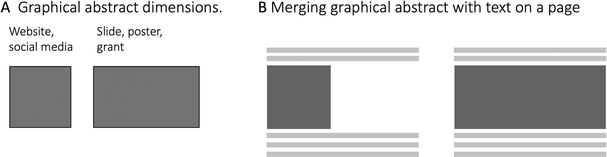
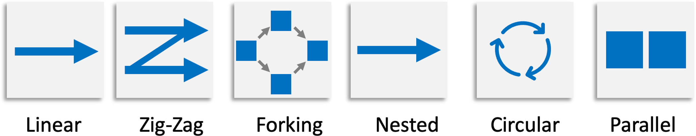
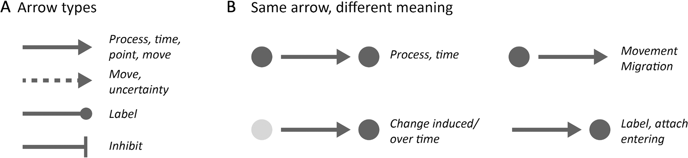
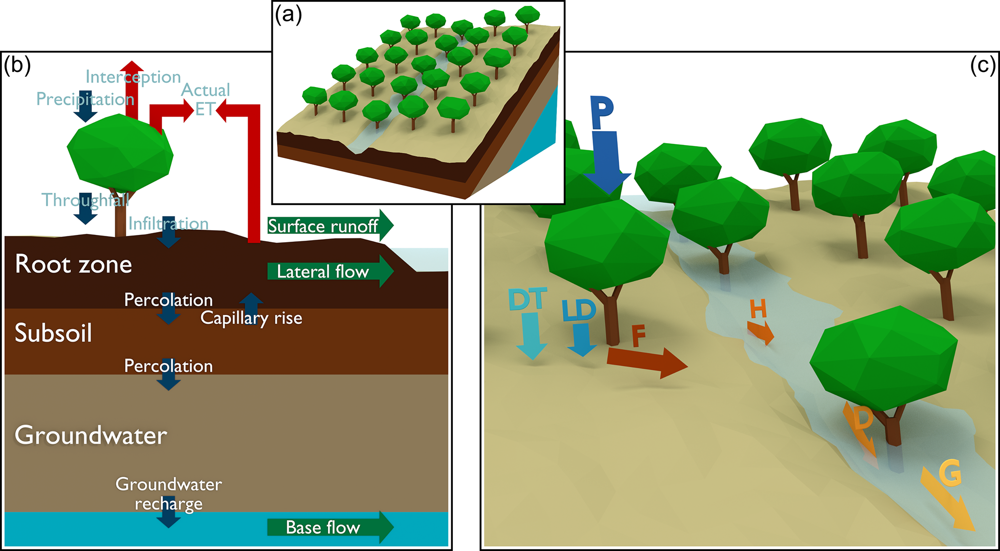

# Reference evidence gallery

每幅保存图均保留原样，供设计学习；不是本项目生成的科学结果或 PR20 已批准资产。缺少许可的内容只给链接。

## E001 · Jambor & Bornhäuser 2024 — Figure 4

画幅与版面占位；规则 R09。

Jambor HK, Bornhäuser M (2024). Ten simple rules for designing graphical abstracts. PLOS Computational Biology 20(2):e1011789. [原始图](https://doi.org/10.1371/journal.pcbi.1011789.g004) · [CC BY 4.0](https://creativecommons.org/licenses/by/4.0/)。未修改。

检查状态：`agent_visual_inspected`；[观察与局限](evidence/visual-review.md)。

## E002 · Jambor & Bornhäuser 2024 — Figure 5

六类布局；规则 R03。注意：选择结构，勿复制装饰。

Jambor HK, Bornhäuser M (2024). Ten simple rules for designing graphical abstracts. PLOS Computational Biology 20(2):e1011789. [原始图](https://doi.org/10.1371/journal.pcbi.1011789.g005) · [CC BY 4.0](https://creativecommons.org/licenses/by/4.0/)。未修改。

检查状态：`agent_visual_inspected`；[观察与局限](evidence/visual-review.md)。

## E003 · Jambor & Bornhäuser 2024 — Figure 6

箭头类型与上下文；规则 R07。

Jambor HK, Bornhäuser M (2024). Ten simple rules for designing graphical abstracts. PLOS Computational Biology 20(2):e1011789. [原始图](https://doi.org/10.1371/journal.pcbi.1011789.g006) · [CC BY 4.0](https://creativecommons.org/licenses/by/4.0/)。未修改。

检查状态：`agent_visual_inspected`；[观察与局限](evidence/visual-review.md)。

## E004 · Eekhout et al. 2018 — Figure 1

真实首图：空间总览、平面剖面与局部过程；规则 R02/R11/R12。可以借分工逻辑，但原图部分标签对比度仍需改善。

Eekhout JPC, Terink W, de Vente J (2018). Earth Surface Dynamics 6:687–703. doi:10.5194/esurf-6-687-2018. [原始图](https://esurf.copernicus.org/articles/6/687/2018/#Ch1.F1) · [CC BY 4.0](https://creativecommons.org/licenses/by/4.0/)。未修改。

检查状态：`agent_visual_inspected`；[观察与局限](evidence/visual-review.md)。

## E005 · BioRender square design infographic

[访问原页面](https://www.biorender.com/blog/top-4-tips-for-designing-a-graphical-abstract) · 页面定位：Full downloadable infographic (square)。

状态：`agent_visual_inspected` / `link_only`。No public asset-repository redistribution grant verified.

## E006 · Patient flow and graphical abstract layout examples

[访问原页面](https://www.simplifiedsciencepublishing.com/resources/best-graphical-abstract-examples-with-free-templates) · 页面定位：Left-to-Right Designs; patient example。

状态：`text_only` / `link_only`。Free template / sharing language not treated as a reusable asset-library license.

## E007 · Bacterial cell: flat construction, gradient and shadow

[访问原页面](https://www.animateyour.science/post/how-to-draw-in-illustrator-a-step-by-step-tutorial-for-researchers) · 页面定位：Dimension and Shading。

状态：`text_only` / `link_only`。Tutorial image redistribution not verified; no image retained.

## E008 · Nature Reviews diagram shared in discussion

[访问原页面](https://www.reddit.com/r/labrats/comments/1duy1nq/how_does_nature_reviews_design_their_diagrams/) · 页面定位：Opening post image。

状态：`uninspected` / `link_only`。Reposted publisher image; original rights chain not established.

## E009 · Four figures reported in cached Xiaohongshu preview

[访问原页面](https://www.xiaohongshu.com/discovery/item/6a16a70b000000003802233a) · 页面定位：User seed note。

状态：`blocked` / `link_only`。Image count and content unverified; no assets retrieved.

## E010 · Zhihu color guide images

[访问原页面](https://zhuanlan.zhihu.com/p/476180854) · 页面定位：Source article。

状态：`blocked` / `link_only`。403; no image or rule extracted.
