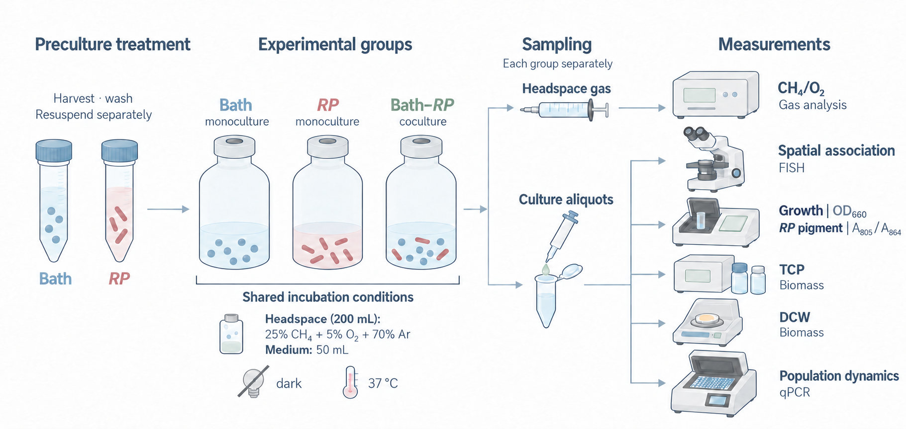
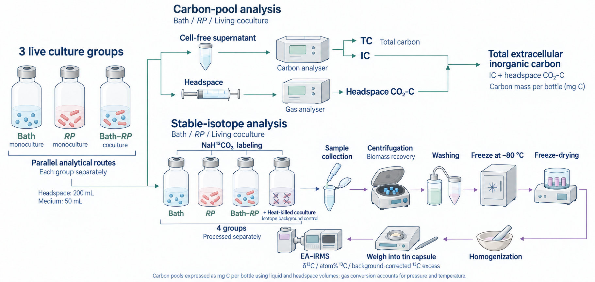

# PR-EXP-Workflow v1 — Experimental workflow figures

A dedicated **experimental / case-derived** SoftSci workflow for culture setup, sampling, preparation and analytical-route schematics. This project packages the user-requested protocol and the Bath–RP iteration evidence. It is not an installed skill or an approved Playbook standard.

## Start here

1. [Workflow and prompt template](PR-EXP-Workflow-v1.md)
2. [Copy-ready method contract](method-contract-template.json)
3. [Validation and limitations](VALIDATION.md)
4. [Reference sources](reference_sources.json)
5. [TIFF export verification](export_verification.json)

Invoke with: **按 PR-EXP-Workflow v1 画实验流程图** and provide this directory plus the confirmed experimental methods.

## Visual anchors

### Fig. 3.1a: accepted style and typography

### Fig. 3.2: draft layout example

The second image is a layout example, not blanket approval of every color or instrument detail. The written protocol takes precedence over accidental defects in a preview. JPEG previews are format conversions of generated PNGs at their original pixel dimensions; provenance is in [the manifest](examples/manifest.json).

## Relationship to other figure work

- [Workbench PR20](https://github.com/yichengzhao46-rgb/codex-workbench/pull/20): mechanism and conceptual scientific visual learning.
- [Workbench PR21](https://github.com/yichengzhao46-rgb/codex-workbench/pull/21): bioinformatics result plots.
- [Workbench PR22](https://github.com/yichengzhao46-rgb/codex-workbench/pull/22): external visual-design scouting.
- [Workbench PR23](https://github.com/yichengzhao46-rgb/codex-workbench/pull/23): additional editorial visual references.

This project starts independently from `main`, adds experimental-workflow specialization, and does not modify or merge those branches. General methods can be considered for Playbook promotion after independent forward validation.

## Packaging boundary

Only workflow documentation, generated example previews, a template and verification/provenance records are committed. Third-party paper figures are link-only. The full-resolution publication TIFF and original delivery ZIP remain separate deliverables; they are not required to use this method. No experimental measurement dataset is included.
